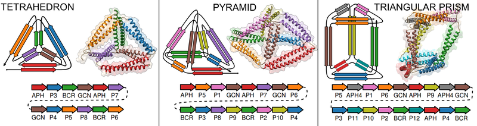

(This is a place holder. Code will be released after publication)

#**CoCoPOD**                                 
## Coiled-Coil Protein Origami Design platform

CoCoPOD is capable of designing amino-acid sequences and building 3D models for arbitrary polyhedral meshes constructed from a single polypeptide chain. The edges of the polyhedron are realized as coiled-coil dimer building modules. The design strategy consists of several steps:

1.	**Specifying the polyhedral geometry**
2.	**Routing the chain**
3.	**Selecting the optimal topology and circular permutation** 
4.	**Selecting the building modules from the CC toolkit**
5.	**Building the 3D model**
6.	**Refining/validating the models via folding simulations** 

**CoCoPOD** performs the first five steps of the design process.  Scripts are provided for automatic execution of all the steps, for maximum flexibility the package functionality is also available from python code.

When using this platform please cite: (TBA).

###**Jump start/Tutorial**
---------------------------------------
Two full examples are provided in the [examples](examples/) subfolder. 
#### TET
The [first example](examples/TET/TET.ipynb) contains a complete tutorial on designing protein origami polyhedral. The tutorial is presented in the from of a python notebook.  The demonstrated steps include loading a geometry (ply) file, enumerating all the typologies and circular permutations, choosing the best topology and constructing and evaluating 3D models.  

#### APHsh
The second, [APHsh](examples/APHsh/make_config.py) is centered on building models and also serves as an integration test. An antiparallel APH segment is built  The second 
To run the program user needs to provide an input file (`make_config.py`) containing information on the sequence of the protein origami design. The input consists of four sections:

* **model_name**, specifying the name of the protein origami design 
* **annotaded_sequence**, where the sequence is broke down into individual CC segments and linkers, for every CC segment a name should be provided
* **pairs_info**, in this section segment pairing is specified. For every pair the orientation (A for antiparallel and P for parallel) of the CC dimer should be provided, along with the name of CC dimer structure template file and name of the chains in the model structure.

An example of the input file can be found under (examples/APHsh/make_config.py)[examples/APHsh/make_config.py]. Two APH segments are connected by a linker forming a covalently linked CC dimer. 
The models can be built and viewed by by typing in the terminal

	cd *path to APHsh folder*	
	snakemake -j3
	chimera */03-*.pdb
	 

###**Installation**
---------------------------------------
Using the [Anaconda](https://docs.continuum.io/anaconda/install) python distribution is recommended as it simplifies installing further dependencies. Dependencies can then easily be installed by running:

	conda install numpy scipy pandas ipython ipython-notebook ipywidgets pyyaml xlrd biopython
	#set the modeller liscence key
	export KEY_MODELLER=XXXX
	conda install -c salilab modeller
	conda install -c omnia mdtraj 
	pip install plyfile doit #not available in conda

respectively. [Chimera](https://www.cgl.ucsf.edu/chimera/download.html) has to be installed separately. Chimera must be available on the system path.
Note: Currently there are some problems installing Modeller via conda on windows. In case of problems use the [standalone installer](https://salilab.org/modeller/download_installation.html).

**PROTEIN ORIGAMI** design software is available as a git repository [protein origami](https://github.com/NIC-SBI/protein_origami). The files can be cloned to any location.

	git clone https://github.com/NIC-SBI/protein_origami.git	
	cd protein_origami
	python setup.py develop

to install the package.

###**Dependencies**
---------------------------------------
The package requires Python 2.7 or Python 3.3+ with numpy and pandas and works on Windows and Linux. On Windows a bash enviorment is recommended and can be obtained by installing [git for windows](https://git-scm.com/download/win).  

Other dependencies:

* [Modeller](https://salilab.org/modeller/)
* [Chimera](https://www.cgl.ucsf.edu/chimera)
* [Snakemake](https://bitbucket.org/snakemake/snakemake/wiki/Home) (only python 3+)
* [MdTraj](http://mdtraj.org)
* [plyfile](https://github.com/dranjan/python-plyfile)
* Numpy, Scipy, pandas, ipython, ipywidgets

Testing:

* [py.test](http://docs.pytest.org/en/latest/)
* [pytest-xdist](https://pypi.python.org/pypi/pytest-xdist) (optional)

###**Tests**
---------------------------------------
Installation can be tested by executing `py.test`, which checks if core modules of the software are working appropriately and all dependencies have been installed.

	conda install pytest
	py.test	

